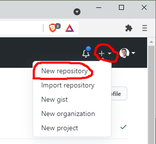
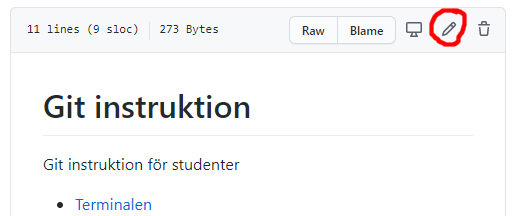
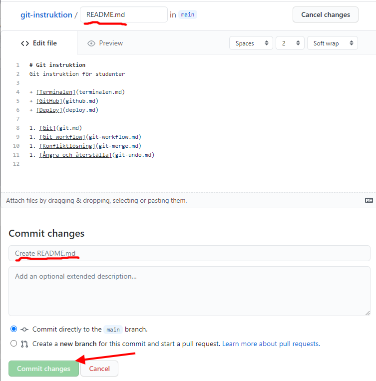
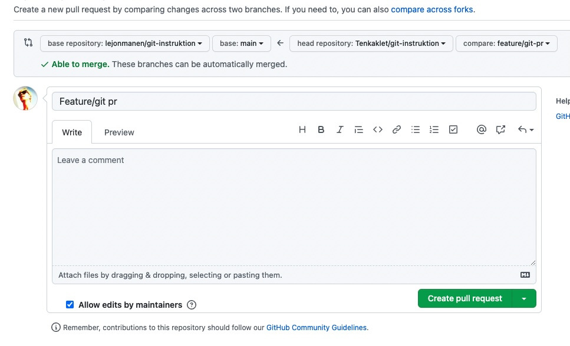

[Innehåll](README.md)

*Uppdaterad VT 2021*

Guiden bygger på att du läst [git.md](git.md) och [terminalen.md](terminalen.md).

# Att arbeta med frontend

1. [Lokalt repo](#lokalt-repo)
1. [Skapa repo på GitHub](#skapa-repo-på-github)
1. [Koppla ihop dina båda repon](#koppla-ihop-dina-båda-repon)
1. [Klona ditt repo](#klona-ditt-repo)
1. [Commit-historik](#commit-historik)
1. [Ändra en fil online](#ändra-en-fil-online)
1. [Pull request](#pull-request)

---

### Lokalt repo
Oftast börjar vi med ett lokalt git-repository. Antingen skapar vi det själva med `git init`, eller så använder vi ett ramverk: `npx create-react-app`. För att skapa ett nytt repo, skriv i terminalen:
```bash
# skapa ett nytt, tomt repo
git init

# skapa vanliga filer
# kom ihåg att fylla i dem när du jobbar med projektet
touch .gitignore
touch README.md

# skapa en package.json fil med standardinställningar
npm init -y
```

### Skapa repo på GitHub
Skapa ett nytt repository. Ge det ett namn (gärna samma som mappen det ligger i på din dator) och fyll i lämpliga inställningar.




### Koppla ihop dina båda repon


Nu när du har ett nytt, tomt repo på GitHub få du förslag på hur du ska lägga till filer. Scrolla ner till alternativet "existing repository" och skriv i terminalen. Exempel:

```bash
# lägg till en "origin" till ditt lokala repo
# detta kopplar ihop det med GitHub
git remote add origin https://github.com/your-github-username/your-repo-name.git

# kontrollera att du gjort rätt - git ska visa "origin" i terminalen
git remote

# byt namn på master-branchen till main
git branch -M main

# pusha dina committade lokala filer upp till GitHub
git push -u origin main
```
Tips! Nästa gång du ska pusha räcker det med att skriva `git push`.

---
### Klona ditt repo
Nu när repot även ligger på GitHub och båda är synkroniserade, kan du ladda ner filerna till en ny mapp. Detta kallas för att *klona* ett repo. Det finns flera anledningar till att man kan vilja klona:

+ man vill jobba med projektet på en annan dator
+ man har förstört sitt lokala repo och vill börja om i en ny mapp
+ man vill titta på någon annans kod

Skriv i terminalen:

```bash
git clone https://github.com/your-github-username/your-repo-name.git
cd your-repo-name/

# installera alla npm-paket som står med i package.json
npm install

# kör start-skriptet (om det finns)
npm run start
```

*Tips! Öppna Atom smidigt med `atom .` i terminalen, eller VS Code med `code .` - innan du startar appen.*

---
### Commit-historik
När man gjort några commits kan man behöva se på sin historik. Skriv i terminalen:
```bash
# de 10 senaste commits som är gjorda i den aktuella branchen
git log --oneline -10
```

Vi kan göra samma sak på GitHub.


*Obs! Main är förvald branch. Om du vill se historik på andra branches behöver du byta.*

---
### Ändra en fil online
Det går att ändra en fil direkt på GitHub. Men varje ändring skapar en egen commit. Använd bara den här metoden för små ändringar.



Klicka på pennan för att börja ändra i filen. Om du inte skriver ett commit-meddelande kommer GitHub välja `"Edit filens-namn"`. Du kan även byta namn på filen.


---
### Pull request
När vi arbetar tillsammans med andra behöver vi sätt att synkronisera vårt arbete, utan att vi får onödigt många merge-konflikter. ([git-merge.md](git-merge.md).) En pull request är egentligen ett webbaserat gränssnitt för att göra `git merge`. Exempel på användningsfall:

+ skicka ändringar från en branch till en annan
+ man vill bidra till ett open source-projekt
+ kontrollera ny kod efter buggar, innan den läggs in i main-branchen

**Det går till så här:**

1. Skapa en ny branch, för att jobba med en ny feature: `git checkout -b feature/feature-name`
1. Jobba med koden, gör commits: `git commit -m "Added new feature to app`
1. När du är färdig: pusha till GitHub: `git push origin feature/feature-name`
1. Gå till din branch i repot på GitHub. GitHub märker automatiskt att din branch har ändringar, som inte finns i main. Det dyker upp en button du kan klicka på för att skapa en pull request.

1. Det går också att skapa en pull request via meny-alternativet "Pull requests"

1. De som äger eller är *collaborators* för repot behöver nu ta ställning till om de vill godkänna din pull request.
1. Efter att en pull request är godkänd kan man ta bort branchen.

Läs mer:
+ [Pull request tutorial - a visual guide](https://yangsu.github.io/pull-request-tutorial/)
+ [Hello world - GitHub guides](https://guides.github.com/activities/hello-world/)
+ [About pull requests - GitHub docs](https://docs.github.com/en/github/collaborating-with-pull-requests/proposing-changes-to-your-work-with-pull-requests/about-pull-requests)
+ [Github standard fork and pull request workflow](https://gist.github.com/Chaser324/ce0505fbed06b947d962)
