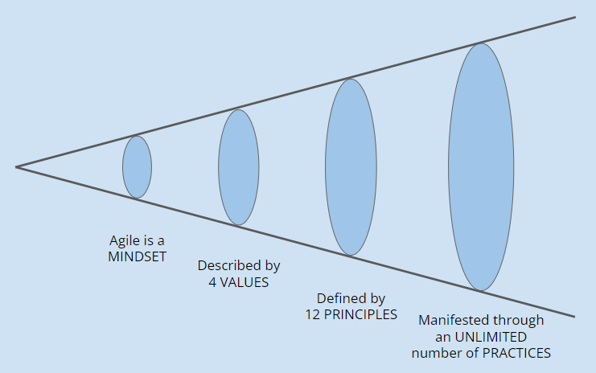

[Innehåll](README.md)

*Uppdaterad september 2023*

1. [Att arbeta agilt](#att-arbeta-agilt)

---

# Arbetsmetodik
Ju större team man arbetar i, desto mindre effektivt blir arbetet. Det tar tid att hålla alla i teamet uppdaterade. Man får lätt en möteskultur - många långa möten, som inte är nödvändiga. Agile kan förstås som ett sätt att försöka upprätthålla effektiviteten.

Alla företag tillämpar de **agila metoderna** till olika hög grad. Man gör det på sitt eget sätt.

# Att arbeta agilt
## Vad är agile?
Det [Agila manifestet](https://agilemanifesto.org/) talar om vad agile är.

> Agile is a **mindset** 
> Described by **4 values** 
> Defined by **12 principles** 
> Manifested through an **unlimited** number of **practices**.

Agile = lättrörligt. Utvecklarteam ska kunna reagera snabbt på ändrade omständigheter. Detta är i mångt och mycket en reaktion på hur IT-projekt sköttes innan.

Några vanliga agila metoder är Scrum, Kanban, Scrumban och SAFe.

---
## Kanban
Kanban är ett sätt att arbeta för att bli mera agila. Man kan arbeta som man har gjort, men arbetsprocessen blir synlig. Det blir lättare att se flaskhalsar.

I ett IT-projekt kan man använda exempelvis *Trello* och *GitHub Projects*. Skapa följande listor:

|Backlog |In progress |Ready for test |Done |
|-|-|-|-|
|En lista med alla *features* som kunden vill ha. Listan prioriteras så att den viktigaste är överst. |När du behöver en ny uppgift, plockar du en från *Backlog* och flyttar över till *In progress*. Nu ser alla teammedlemmar att du arbetar med den uppgiften. Man ska bara arbeta med en uppgift åt gången. |När du är färdig med uppgiften flyttar du den hit. Nu ska någon annan i teamet kontrollera att kraven för uppgiften är uppfyllda. |Om alla krav är uppfyllda flyttas uppgiften till *Done*. När alla uppgifter i backlog har flyttats hit, är projektet färdigt. |

---
## Scrum
Ett team som följer *scrum* arbetar i *sprintar*. En *sprint* kan vara olika lång, men typiskt sett 2-4 veckor. Korta sprintar leder till att teamet blir mera lättrörligt (kan reagera snabbare på ändrade krav från kunden), men man hinner inte göra lika mycket på varje sprint.

Normal storlek på ett team brukar vara 3-8 personer. Ett scrum-team har olika *roller* och *ritualer*.

#### Roller
| Roll | Uppgift |
|------|---------|
| Produktägare (product owner) | Teamets kontaktperson hos kunden. Är inte en del av teamet. |
| Scrum master | Ser till att teamet följer scrum. Leder möten. Ser till att eventuella hinder för teamet blir undanröjda - men måste inte göra det själv. |
| Utvecklare | Alla i teamet är utvecklare. |

### Ritualer
| Ritual | När | Innehåll |
|--------|-----|----------|
| Sprint planning       | Det första som händer i en sprint. | Prioritering och tidsuppskattning av uppgifter i *product backlog*. Målet är att skapa en *sprint backlog* med det som teamet tror sig hinna med under sprinten. |
| Daily scrum / standup | Först på morgonen, varje dag. | 5-10 minuter där alla i teamet står upp och svarar på frågorna:   1. Vad gjorde du sedan förra standup?   2. Vad ska du göra till nästa?   3. Finns det något som hindrar dig? |
| Sprint review         | Sist i en sprint | Teamet demonstrerar vad man hunnit med för produktägaren. |
| Sprint retrospective  | Direkt efter sprint review | Teamet utvärderar sitt arbete under sprinten. Scrum master ställer frågorna till teamet:   1. Vad ska vi sluta göra?   2. Vad ska vi fortsätta göra?   3. Vad ska vi börja göra? |

---
## XP
XP är inte en metod, utan ett samlingsnamn för flera *praktiker*. De flesta har redan anammats och införlivats i de andra metoderna. Några exempel:

### Parprogrammering
Två (eller fler) personer sitter vid samma dator. En skriver kod (förare) och den andra tittar på (observatör). Föraren kan fokusera på skrivandet och de närmaste raderna. Observatören kan ha en överblick över vart man är på väg och har lätt för att hitta buggarna i den föraren skriver. Parprogrammering fungerar bra för kunskapsöverföring mellan teammedlemmar.

### TDD
Testdriven utveckling (Test-Driven Development) är ett systematiskt sätt att arbeta, för att skriva bättre kod. I stället för att skriva kod som löser uppgiften direkt, skriver man **kod som testar om uppgiften är löst**.

Efter som man börjar med att skriva testfall, så kommer testen att vara **röda**, dvs rapportera att kraven för uppgiften inte är uppfyllda.

När man har ett rött tesfall skriver man tillräckligt med kod för att göra testfallet **grönt**, dvs att kravet är uppfyllt.

Sist **refaktorerar** man koden så att man lämnar den i bra skick.

Testfallen körs varje gång man har gjort en ny version av koden. På så vis kan man se om någon ändring man gör, riskerar att bryta mot ett tidigare krav, genom att det kravets testfall blir röda. Många buggar fångas tidigt och koden får en högre kvalitet.

### Continuous Integration / Deployment
Det kan kännas riskabelt att publicera en ny version av ett projekt. Ju fler förändringar, desto större risk. CI/CD handlar om att det ska vara lätt att publicera en ny version, och man ska göra det ofta.

Genom att släppa många små versioner, snarare än en stor, blir varje release mindre dramatisk. Färre buggar hinner uppstå, och de som dyker upp är lättare att lösa.
