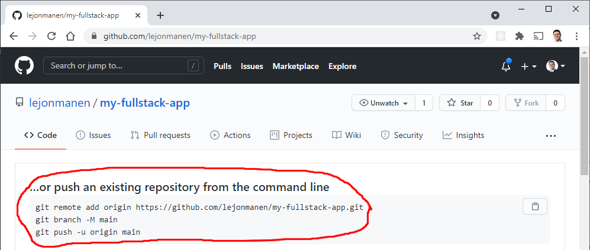
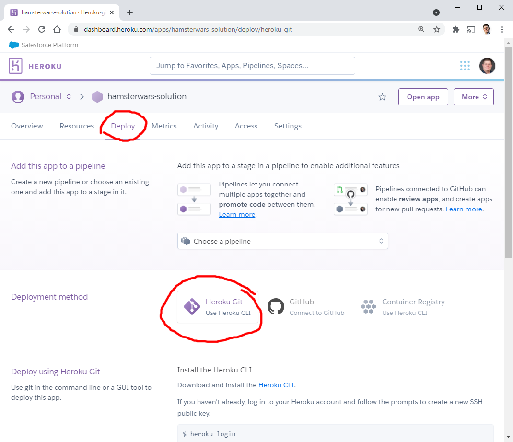
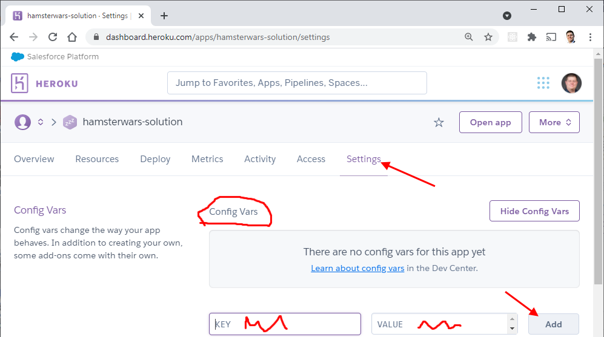

[Innehåll](../README.md)

*Uppdaterad juli 2024*

# Deploy

1. [Översikt](#översikt---olika-sätt-att-publicera-sin-app)
1. [Vanliga lösningar](#vanliga-lösningar)
1. [Publicera fullstack app](#publicera-fullstack-app)
1. [Tips för felsökning](#tips-för-felsökning)

### Översikt - olika sätt att publicera sin app

|Namn         |Backend? |Kommentar |
|-------------|---------|---|
|GitHub Pages |Nej      |Behöver ett GitHub-repo. Lite invecklat att publicera nya versioner. |
|Render       |Ja       |Kan publicera node.js eller Docker containers. |
|Heroku       |Ja       |Kan publicera node.js eller Docker containers. Inte gratis. |
|surge.sh     |Nej      |Extremt lättanvänt npm-skript |
|Netlify      |Delvis   |Publicera enskilda routes med serverless functions |
|Firebase     |Delvis   |Finns både för frontend och backend. Stöd för databas i frontend. |
|AWS          |Ja       |Krångligt, men kan allt. |

### Vanliga lösningar
1. Publicera en webbserver, som servar både frontend-appen och eventuellt API
1. Publicera API webbserver och frontend-app separat
1. Publicera bara en frontend-app och kör backend med serverless i molnet

Teknikstack för den här guiden:

|Teknik    |Används till |
|----------|-|
|Node.js   |Köra lokal utvecklingsmiljö, bygga appen |
|Express   |Backend webbserver |
|React/Vue |Frontend app |
|Heroku    |Publicera fullstack-appen |

---
### Publicera fullstack app
*Skriven juni 2021*
1. [Skapa frontend-projekt](#1-skapa-frontend-projekt)
1. [Skapa repo på GitHub](#2-skapa-repo-på-github)
1. [Lägga till Express webbserver](#3-lägga-till-express-webbserver)
1. [Inställningar](#4-inställningar)
1. [Inställningar på Heroku (hemligheter)](#5-inställningar-på-heroku-hemligheter)
1. [Hemliga inställningar](#6-hemligheter)
1. [Publicera](#7-publicera)

---
#### 1 Skapa frontend-projekt
*Den här guiden förutsätter att du använder React. Men Vue fungerar lika bra.*
```bash
# Använd Vite för att sätta upp projekt
npm init vite@latest your-app-name
```
---

#### 2 Skapa repo på GitHub


*Skapa ett nytt repo på GitHub. Tips: det är praktiskt om du använder samma namn som i steg 1.*



*Koppla ihop ditt nya GitHub-repo med repot på din dator.*

Kontrollera att du har rätt genom att skriva i terminalen: `git status`

---
#### 3 Lägga till Express webbserver
Express ska installeras i samma mapp som frontend-projektet. Skriv i terminalen:
```bash
npm i express cors
# express är din webbserver
# cors är en middleware som låter dig bygga ett REST API, du behöver det om en frontend på en annan server ska använda API:et

mkdir backend/
touch backend/server.js
# Skapa mapp för dina backend-filer och en tom fil där du kan lägga serverkoden
```

[Exempel på en minimal webbserver med Express](https://expressjs.com/en/starter/hello-world.html)

---
#### 4 Inställningar
Filen `package.json` är som standard konfigurerad för enkla frontend-appar. Du behöver ändra i `script`-delen och lägga till en `proxy`. Mer information: [Setting up proxy server on Vite](https://dev.to/ghacosta/til-setting-up-proxy-server-on-vite-2cng) och [devServer.proxy i Vue](https://cli.vuejs.org/config/#devserver-proxy).

*Exempel på del av ändrad package.json. Använd samma portnummer för proxy som du skriver i backend/server.js.*

```json
"proxy": "http://localhost:1337/",
"scripts": {
  "start-backend": "node backend/server.js",
  "start-frontend": "vite dev",
}
```

---
#### 5 Inställningar på Heroku (hemligheter)
*Uppdatering december 2022: Heroku har inte längre en gratisplan. Ett bra alternativ är [www.render.com](https://render.com/).*

Skapa en ny app på Heroku: [www.heroku.com](https://www.heroku.com)

Kontrollera att *Heroku Git* är valt, under Deploy-fliken.


Installera Heroku CLI. Skriv i terminalen:
```bash
npm i -g heroku
heroku login
# autentisera i webbläsaren

heroku git:remote -a namn-på-din-heroku-app
git remote
# anslut ditt lokala repo till Heroku
# kontrollera att git remote visar både "origin" och "heroku"
```

---
#### 6 Hemligheter
Om du använder en databas eller en molntjänst, så behöver du inloggningsuppgifter. Sådana uppgifter ska *inte finnas med i ditt git-repo, för då blir de synliga för alla på GitHub!* Vi använder *environment variables* (miljövariabler) för att lösa det.

Heroku använder variabeln `PORT` för att tala om vilken port din server ska lyssna på. Ändra i din serverfil:
```js
// byt ut detta:
const PORT = 1337

// till det här:
const PORT = 1337 || process.env.PORT
```

Molndatabasen Firestore lägger dina inloggningsuppgifter i en JSON-fil. Du måste lägga till filnamnet i din .gitignore. Exempel:
```
# .gitignore-filen
node_modules/
DS_Store
private-key.json     <-- namnet på filen med inloggningsuppgifter
```

Kopiera *innehållet* i filen och klistra in det som `VALUE` i en miljövariabel på Heroku, med namnet `PRIVATE_KEY`:


Ändra sedan i koden. Exemplet förutsätter att du har en JSON-fil med hemlig information i samma mapp som server.js:
```js
// byt ut detta:
const privateKey = require('./private-key.json')

// mot det här:
let privateKey;
if( process.env.PRIVATE_KEY ) {
	privateKey = JSON.parse(process.env.PRIVATE_KEY)
} else {
	privateKey = require('./private-key.json')
}
```

---
#### 7 Publicera
Nu är du klar att publicera!
```bash
git push heroku main
```
När du pushar kommer din senaste commit att skickas till servern. Heroku börjar bygga appen genom att köra `npm run build`. När appen är klar startas appen med `npm run start`, som kör ditt start-skript.

Heroku dashboard, fliken **Overview**, uppdateras i realtid när Heroku bygger appen. När den är färdig kan du klicka på knappen **Open app**. Om något går fel kan du läsa i loggfilerna via **More**-knappen till höger om Open app. Alla console.log som du har i backend/server.js visas i loggfilen.

---

### Tips för felsökning
1. Om du inte ser något alls:
	1. Titta i webbläsarens console om det finns några felmeddelanden
	1. Använd "Visa sidkälla" (View source, högerklicka på den tomma webbsidan) för att se om du har en index.html som ser riktig ut. Kontrollera sökvägarna i filen genom att öppna dem i en ny flik.
	1. Titta om appen ser ut att vara startad på Overview-fliken
	1. Se om det finns några fel i loggfilen

1. Om bilder eller CSS inte fungerar:
	1. Du har fel sökvägar. Antingen använder du fel sökväg, eller så servar inte din Express-server rätt saker för bildens eller filens URL.
	1. Bild: Inspektera en bild med webbläsarens utvecklarläge, kopiera sökvägen till bilden och öppna den i en ny flik.
	1. CSS: Leta upp sökvägen via "Visa sidkälla". Öppna i en ny flik och se vad som händer.

1. Om AJAX inte fungerar:
	1. Kontrollera att du lagt till en proxy på det sätt som ramverket kräver. Kontrollera att du skriver `fetch('/api/exempel/')` i koden, snarare än `fetch('http://localhost:1337/api/exempel/')`.
	1. Skriv ut vilken URL du använder i webbläsarens console före varje fetch request. Kontrollera om URL:en ser rimlig ut.
	1. Prova URL:en i ett verktyg som Insomnia eller Postman.

Ship away!
