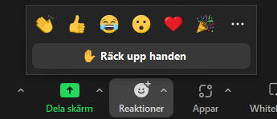
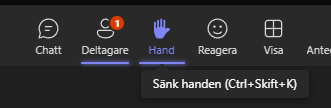

[Innehåll](../README.md)

# Videomöten

Videomöten har blivit allt vanligare. För att ha produktiva möten, är det viktigt att vi är överens om vissa förhållningsregler.

## Utrustning

Om du har regelbundna distansmöten, är utrustningen kritisk.

### 1 Stabil internetuppkoppling
Om du har en långsam eller instabil uppkoppling kommer du att uppleva att du blir utkastad från möten (av programvaran) eller att det inte går att slå på kamera och dela skärm.

### 2 Headset
Använd inte datorns inbyggda mikrofon/högtalare. Ljudet från datorns högtalare kan fångas upp av mikrofonen när du pratar, och de andra deltagarna hör ett eko. Ett headset däremot sitter på öronen och därför läcker inte ljudet.

+ Du får händerna fria
+ Du undviker eko
+ Ljud från mötet läcker inte ut i din omgivning

### 3 Kamera
Från mycket tidig ålder har vi tränats i att läsa människor. Vi registrerar kroppsspråk och ansiktsuttryck. När man inte kan se den man talar med, tappar vi en betydande del av kommunikationen. Det är lättare att missförstå varandra. Men ansikten kan också stjäla uppmärksamheten från den som pratar och det kan bli kaotiskt i stora grupper.

|Mötesform              |Policy |
|-|-|
|Handledning med lärare |Kamera alltid på. |
|Parprogrammering       |Kamera på. Dela skärm och/eller använd Live Share i VS Code. |
|Grupparbete: möte      |Kamera på. |
|Grupparbete: övrig tid |Gruppen bestämmer. |
|Presentation av arbete |De som presenterar ska ha kamera på. |
|Genomgång med lärare   |Kamera av, utom för läraren. |

---

## Ställa frågor
När man är många på ett möte så kan det bli rörigt om det är flera som pratar samtidigt. I ett klassrum kan man ofta lösa det med hjälp av kroppsspråk, så att deltagarna ser när det finns en lucka. När vi har distansmöten kan det vara svårare att komma till tals. Alla videomötesprogram har en "handuppräckningsfunktion". Lär dig använda den. (Tips: glöm inte att ta ner handen efter du har fått ställa din fråga.)

**Skriva i chatten är alltid okej**, gör det mycket och ofta. Om det verkar som om läraren missar det som skrivits, så kan det vara för att programvaran inte är så bra på att visa det. Då går det bra att räcka upp handen och fråga om man har sett chatten.

**Prata rätt ut går bra i en mindre grupp**, så länge alla tycker att det är okej.

**Räcka upp handen är att föredra i större grupper**. Ofta kan läraren se i vilken ordning man räckt upp handen, och kan välja när det blir ett lämpligt tillfälle att släppa in frågan.

|Programvara |Bild |
|-|-|
|Google Meet     | |
|Zoom            | |
|Microsoft Teams | |

---

## Leda möten

För dig som ska hålla i en presentation, en lektion eller i något annat sammanhang ska leda ett möte.

Se till att de som är närvarande förstår syftet med mötet. Berätta vad som kommer hända och hur långt mötet är. (På YH bestäms det mesta av schemat.)

Presentera dig och deltagarna, om ni är nya för varandra.

Uppmuntra till delaktighet. Förklara gärna hur man ska göra för att t.ex. ställa frågor.

När du frågar deltagarna något, försök undvika att ställa öppna frågor rakt ut. Öppna frågor är bra att diskutera i grupp. Men om man vill ha ett snabbt svar, är det enklaste att formulera frågan som en "ja/nej" fråga och ställa två frågor. Detta sätt används i föreningar för att fatta demokratiska beslut.

1. Alla som svarar JA räcker upp handen NU
1. Alla som svarar NEJ räcker upp handen NU

Om saker ska bestämmas på mötet, se till att någon (måste inte vara du) antecknar.

Om mötet ska spelas in, se till att deltagarna och de som inte kunde komma får tillgång till länken efter mötet. Det är viktigt att alla vet om att de blir inspelade.

Avsluta gärna mötet med en "cliffhanger" eller en "sneak preview" av vad som ska hända på nästa möte.
