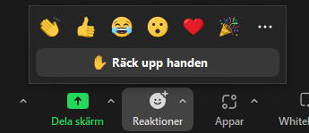
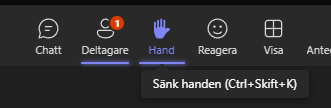
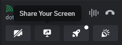
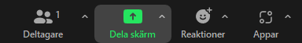

[Innehåll](../README.md)

*Uppdaterad juli 2024*

1. [Utrustning](#utrustning)
1. [Ställa frågor](#ställa-frågor)
1. [Skärmdelning](#skärmdelning)
1. [Leda möten](leda-möten)

---

# Videomöten

Videomöten har blivit allt vanligare. För att ha produktiva möten, är det viktigt att vi är överens om vissa förhållningsregler.

## Utrustning

Om du har regelbundna distansmöten, är utrustningen kritisk.

### 1 Stabil internetuppkoppling
Om du har en långsam eller instabil uppkoppling kommer du att uppleva att du blir utkastad från möten (av programvaran), eller att det inte går att slå på kamera och dela skärm, eller att bilden laggar och ljudet blir sämre.

### 2 Headset / earbuds
Använd inte datorns inbyggda mikrofon/högtalare. Ljudet från datorns högtalare kan fångas upp av mikrofonen när du pratar, och de andra deltagarna hör ett eko. Ett headset däremot sitter på öronen och därför läcker inte ljudet. Earbuds fyller samma funktion, så länge som de har en bra mikrofon. Ett bra headset går att hitta för 100-200 kr. Fördelar:

+ Du får händerna fria
+ Du undviker eko
+ Ljud från mötet läcker inte ut i din omgivning

### 3 Kamera
Från mycket tidig ålder har vi tränats i att läsa människor. Vi registrerar kroppsspråk och ansiktsuttryck. När man inte kan se den man talar med, tappar vi en betydande del av kommunikationen. Det är lättare att missförstå varandra. Men ansikten kan också stjäla uppmärksamheten från den som pratar och det kan bli kaotiskt i stora grupper.

|Mötesform              |Policy |
|-|-|
|Handledning med lärare |Kamera alltid på. |
|Parprogrammering       |Kamera på. Dela skärm och/eller använd Live Share i VS Code. |
|Grupparbete: möte      |Kamera på. |
|Grupparbete: övrig tid |Gruppen bestämmer. |
|Presentation av arbete |De som presenterar ska ha kamera på. |
|Genomgång i stor grupp |Kamera av rekommenderas. |
|Genomgång i liten grupp|Kamera på rekommenderas. |

*En del lärare tycker att det blir för kaotiskt att alla har på sina kameror och det kan vara distraherande. Andra tycker att kamerorna ger en bättre kontakt - när man sitter i klassrummet går det inte att "bli osynlig", så varför skulle man behöva göra det online?*

---

## Ställa frågor
När man är många på ett möte så kan det bli rörigt om det är flera som pratar samtidigt. I ett klassrum kan man ofta lösa det med hjälp av kroppsspråk, så att deltagarna ser när det finns en lucka. När vi har distansmöten kan det vara svårare att komma till tals. Alla videomötesprogram har en "handuppräckningsfunktion". Lär dig använda den. (Glöm inte att ta ner handen efter du har fått svar på din fråga.)

**Skriva i chatten är alltid okej**, gör det mycket och ofta. Om det verkar som om läraren missar det som skrivits, så kan det vara för att programvaran inte är så bra på att visa det. Det är också lätt att missa det som skrivit om det är mycket aktivitet i chatten. Då går det bra att räcka upp handen och fråga om läraren har sett chatten - eller skriva frågan igen.

**Prata rätt ut går bra i en mindre grupp**, så länge alla tycker att det är okej.

**Räcka upp handen är att föredra i större grupper**. Ofta kan läraren se i vilken ordning man räckt upp handen, och kan välja när det blir ett lämpligt tillfälle att släppa in frågan.

|Programvara     |Ikon |Bild |
|----------------|-----|-----|
|Google Meet     |Hand | |
|Zoom            |Reaktioner | |
|Microsoft Teams |Hand | |

---

## Skärmdelning

Alla videomötesprogram har funktioner för att dela skärm. Du kan välja om du vill dela *ett fönster* eller *hela den synliga skärmen*. Om du har mer än en skärm ansluten till datorn, måste du välja vilken skärm du ska dela.

**Obs! Om du använder MacOS** måste du ändra en inställning för varje program som ska kunna dela skärm. [Läs mer här](mac-screen-share.md).

Vissa program kan visa olika ikoner beroende på om man är mötesledare eller inte.

Tänk på att välja hela skärmen om du ska visa vad du kodar, eftersom man ofta byter mellan koden (VS Code) och webbläsaren.

|Programvara     |Ikon |Bild |
|----------------|-----|-----|
|Discord         |Skärm med böjd pil, "Share your screen" | |
|Google Meet     |Ruta med pil upp, "Present now" | |
|Zoom            |Ruta med pil upp, "Dela skärm" | |
|Microsoft Teams |Ruta med pil upp, "Dela" | |

### Projektor

Om du ska dela din skärm med en projektor behöver man gå till bildskärmsinställningarna. På Windows kan du välja mellan att *Duplicera* din skärm, eller att *Utvidga* den.

**Duplicera** är samma sak som att spegla. Du skickar en exakt kopia av datorns skärm till projektorn. Om du använder denna finns det en risk att du inte kan se annat än det som presenteras, till exempel meddelanden i videoprogrammets chat eller uppräckta händer.

**Utvidga** innebär att du skapar en ny virtuell skärm. Du kan behandla den som om du hade två fysiska skärmar bredvid varandra, och dra över fönster mellan dem. Använd denna för bästa kontroll.

---

## Leda möten

För dig som ska hålla i en presentation, en lektion eller i något annat sammanhang ska leda ett möte.

Se till att de som är närvarande förstår syftet med mötet. Berätta vad som kommer hända och hur långt mötet är. (På YH bestäms det mesta av schemat.)

Presentera dig och deltagarna, om ni är nya för varandra.

Uppmuntra till delaktighet. Förklara gärna hur man ska göra för att t.ex. ställa frågor.

När du frågar deltagarna något, försök undvika att ställa öppna frågor rakt ut. Öppna frågor är bra att diskutera i grupp. Men om man vill ha ett snabbt svar, är det enklaste att formulera frågan som en "ja/nej" fråga och ställa två frågor. Detta sätt används i föreningar för att fatta demokratiska beslut.

1. Alla som svarar JA räcker upp handen NU
1. Alla som svarar NEJ räcker upp handen NU

Om saker ska bestämmas på mötet, se till att någon (måste inte vara du) antecknar.

Om mötet ska spelas in, se till att deltagarna och de som inte kunde komma får tillgång till länken efter mötet. Det är viktigt att alla vet om att de blir inspelade.

Avsluta gärna mötet med en "cliffhanger" eller en "sneak preview" av vad som ska hända på nästa möte.
