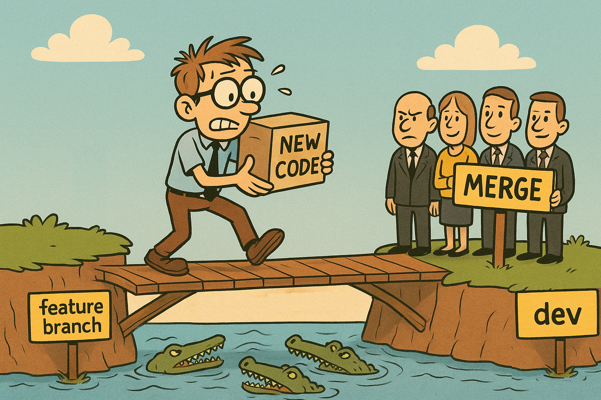

[Innehåll](../README.md)

Tillbaka till del 1: [Kommandoreferens](git.md)


1. [Workflow](#workflow)
1. [Skapa projekt](#skapa-projekt)
1. [Pull request](#pull-request)
1. [Genomför merge](#genomför-merge)
1. [Testa koden på din dator](#testa-koden-på-din-dator)


# Workflow

Arbetsflöde: de flesta team arbetar idag med branches och tar hjälp av GitHub för att skapa struktur i arbetet.

## Skapa projekt

Skapa först ett projekt på GitHub.

Starta sedan terminalen i den mapp du vill lägga repot. Skriv i terminalen:

```bash
# Klona ner repot till din dator
git clone url-till-repo

# Lista mappar - så du ser vad nya mappen heter
ls

# Gå in i den nedladdade mappen
cd mappnamn/

# Skapa en dev-branch och gå in i den
# Arbeta aldrig direkt i main! Då skapar du konflikter för alla andra i teamet.
git branch dev
git switch dev
```

Nu är det dags att börja jobba. Låt säga att du får i uppgift att göra en grid layout för produkterna i en webbshop. Detta är en tillräckligt stor uppgift för att man ska betrakta det som en *feature*. Skriv i terminalen:

```bash
git branch feature/product-grid
git switch feature/product-grid

# Nu står vi i branchen. Jobba med koden och gör regelbundna commits.
# När du är färdig ska koden publiceras. Lägg först till alla ändringar
git add --all

git commit -m "Feature product-grid done"

# Första gången du pushar måste du tala om för GitHub vad branchen ska heta på GitHub. Det kan ju hända att någon annan råkat pusha en annan branch med samma namn, om vi har otur.
git push origin feature/product-grid
# Nästa gång räcker det med att skriva: git push
```

Nu är det dags att återvända till webbläsaren och fliken med git-repot. Ladda om sidan, så kommer du se en notis: GitHub har sett att branchen *feature/product-grid* har "recent changes". Alltså den koden som du precis laddade upp. Klicka på länken i notisen för att skapa en pull request.

*Om du inte ser notisen måste du skapa en pull request manuellt. Klicka på menyalternativet "Pull Request".*




## Pull request
När du klickar på knappen för att skapa en pull request, är det som om du säger:

*"Snälla pulla min kod in i din branch"*

Nu vill vi ha en annan teammedlem som granskar koden.

*"Ja, efter att jag kollat så att koden är bra."*

Man kan välja "reviewer". Det kan vara en eller flera teammedlemmar som tilldelas rollen att granska din kod. På så sätt vet man att ingen i teamet kan "smyga in" buggig kod. Målet är att man inte ska kunna överraskas av att saker slutar fungera.

*All kod man producerar ska granskas av minst en annan person!*

*Tips: du måste inte utse en reviewer, utan den i teamet som först får en lugn stund kan ta på sig uppgiften.*

Nu är det dags: **skapa din pull request**!


## Genomför merge
När den som granskar är nöjd klickar man på knappen mer att godkänna pull requesten och integrera den i branchen. (Oftast dev-branchen.)

GitHub gör en *merge*. Förhoppningsvis går den automatiskt. Men det kan hända att något går fel. Använd webbsidan för att tala om för GitHub hur eventuella konflikter ska lösas.

## Testa koden på din dator
Skriv i terminalen

```bash
# Förutsatt att pull requesten ska skicka koden till dev-branchen
git switch dev

# Kontrollera vad som eventuellt finns på GitHub - du ska se att det finns flera commits att ladda ner
git fetch
git status

# Nu kör vi! Dra ner koden!
git pull
```

Git laddar ner koden till dev-branchen. Öppna VS Code för att titta på den, och starta live server för att se den i webbläsaren. Kontrollera alla sidor (viktigast de som påverkas av ändringarna du har gjort) så att de fortfarande fungerar. (Ibland missar man något.)

Om allting ser bra ut är du färdig.

Nu är du redo att arbeta professionellt med Git och GitHub!
