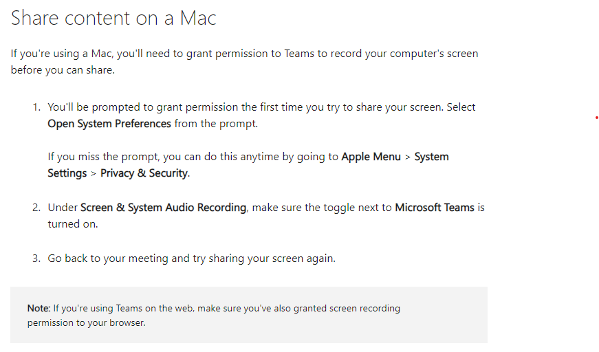
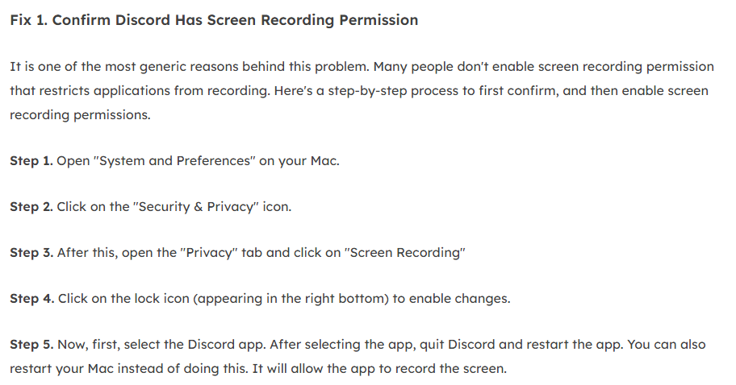

[Innehåll](../README.md)

*Uppdaterad juli 2024*

---

# Dela skärm som MacOS-användare

MacOS är till skillnad från Windows designat med säkerhet från grunden. På grund av detta är inte skärmdelning automatiskt påslaget, utan du måste själv välja vilka program du litar på, och konfigurera dem.

Inställningen man behöver göra heter *Screen Recording*. (Appen som ska dela skärmen behöver först få lov att spela in det som visas.)

1. Öppna "System and Preferences"

1. Klicka på "Security and Privacy"

1. Klicka på fliken "Privacy", sedan "Screen Recording"

1. Klicka på hänglåset. Detta låser upp möjligheten att ändra inställningarna.

1. Nu kan du välja ut apparna var för sig och ge dem tillåtelse att spela in skärmen. (Discord, Teams, Zoom, Chrome m.fl.)

1. Starta om appen för att de nya inställningarna ska börja gälla.

---

---

