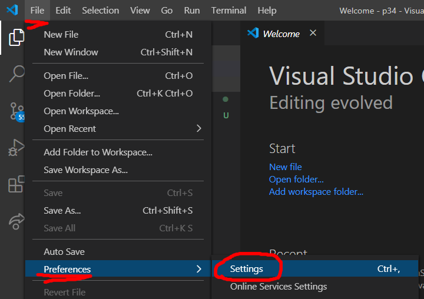
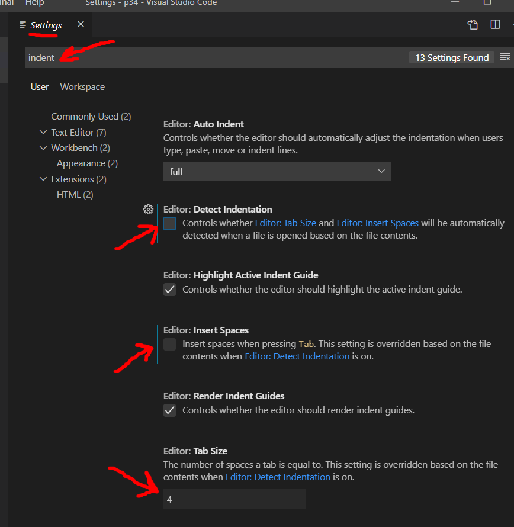
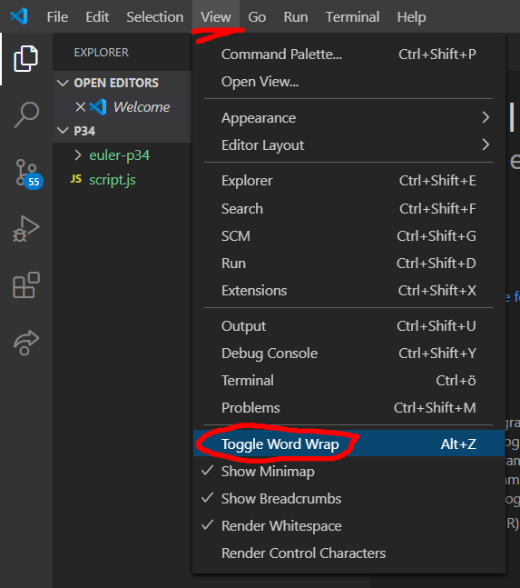

## VS Code: rekommenderade inställningar

Det är viktigt att konfigurera din editor så att du kan arbeta effektivt i den. Här är några starkt rekommenderade inställningar för VS Code. Du kan göra samma inställningar i andra editorer också, men menyerna ser lite annorlunda ut.

#### Öppna inställningarna
Du hittar inställningarna under menyn `File > Preferences > Settings`


#### Indent
Indentering är avståndet mellan vänsterkanten i editorn och din kod. När vi börjar ett nytt block, lägger vi till en extra indentering. Justera indenteringen med tab-tangenten. Exempel:

```javascript
let variabel = 1;  // ingen indentering
if( variabel === 1 ) {
	// nu är vi inuti ett kodblock - känn igen kodblock på curly braces: { }
	if( something !== null ) {
		// nu är vi inuti ett nytt kodblock, en nivå indentering till
	}
}
```


Erfarna programmerare kan ha långa diskutioner om huruvida indenteringen ska göras med tecknet mellanslag eller tab, samt om hur många tecken stor indenteringen ska vara. Här finns många starka åsikter. Kort sagt handlar det inte om rätt eller fel, utan snarare en "best practice". På varje företag bestämmer man hur man vill arbeta.

Skriv "indent" i sökfältet och fyll i kryssrutorna enligt de röda pilarna i bilden.


*Insert spaces* ska vara avstängd. Det gör att tab-tecknet används för indentering. Då kan användare som använder en annan inställning än du för "tab size" se koden så som de vill ha den. För att det ska fungera måste "Detect indentation" vara avstängd.

*Tab size* ska du sätta till 4. Det blir 4 tecken varje gång du indenterar. Fördelar med en stor indentering:

+ lättare att se vilken kod som tillhör vilket block
+ lättare att se när en funktion börjar bli för komplicerad

---

#### Word wrap
Det värsta som finns är att scrolla i sidled. Vi kan tala om för editorn att den automatiskt ska lägga in radbrytningar, om en rad blir för lång - det kallas *word wrap*. Skriv "wrap" i sökfältet och ändra word wrap till "on".


Man kan även aktivera eller stänga av *word wrap* för en fil i taget via menyn `View > Toggle Word Wrap`.


