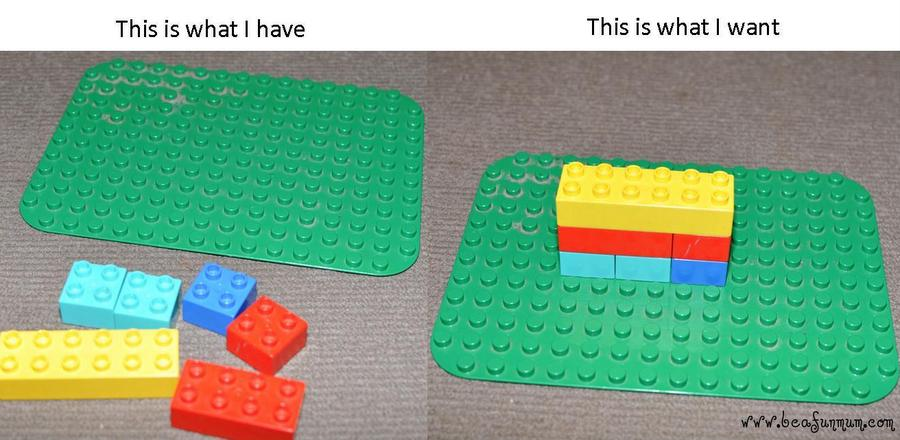
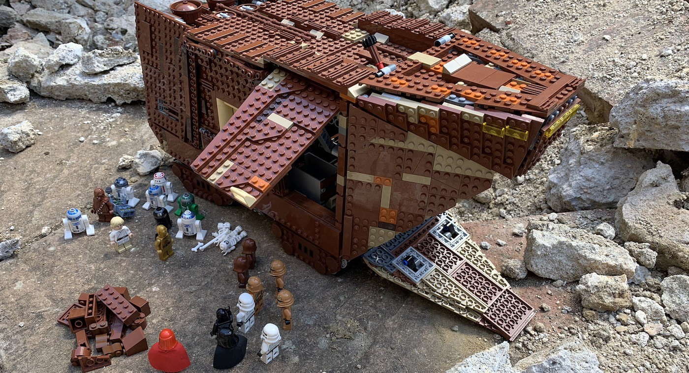
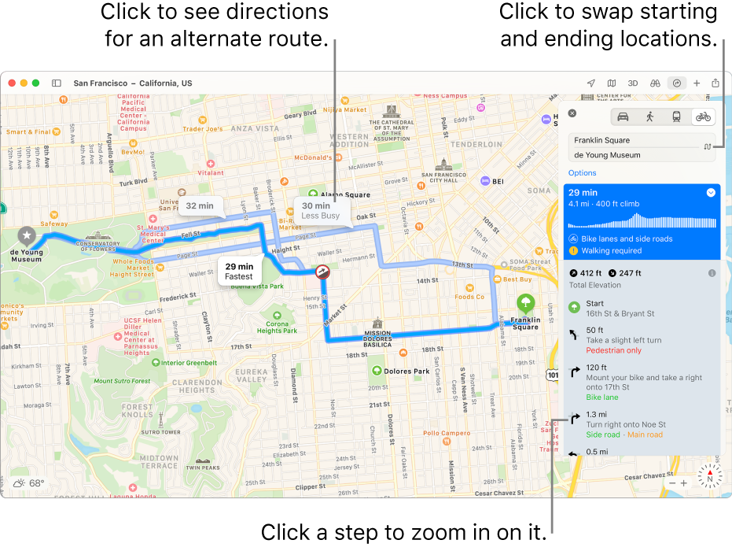
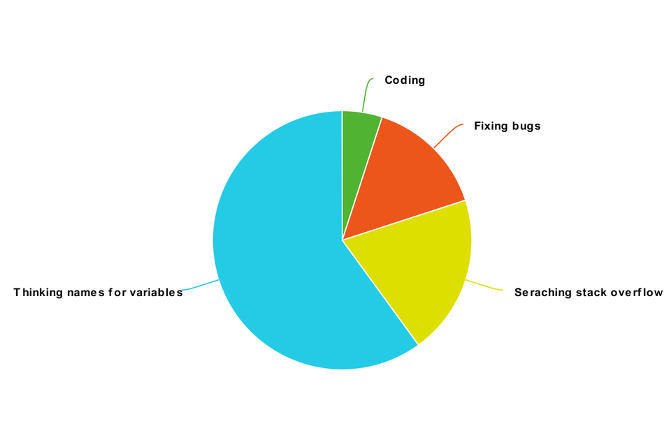

[Innehåll](README.md)

*Uppdaterad HT 2021*

1. [Problemlösning](#problemlsning)
1. [Tänka som en dator](#tnka-som-en-dator)
1. [Att följa en specifikation](#att-flja-en-specifikation)
1. [Att arbeta med andra](#att-arbeta-med-andra)

---

# Att skriva bra kod
## Problemlösning
Programmering handlar om att lösa problem. Många problem kan verka stora och svåra vid första anblicken. Det är viktigt att man arbetar *metodiskt och strukturerat*.

#### Top down

Top down-metoden börjar med att se helheten, the big picture. Sedan delar man in det stora problemet i flera mindre delar. Hur gör du för att lösa ett stort pussel?
+ samlar ihop kantbitarna och sätter ihop dem
+ samlar alla bitar med en viss färg
+ samlar alla bitar med ett distinkt motiv

När man blir klar med delarna, sätter man samma dem. Detta kallas ibland "divide and conquer".

*Pussel tränar många färdigheter som är viktiga när man programmerar.*

---

#### Bottom up

Använd det du har. Börja med de minsta beståndsdelarna. Kombinera dem för att skapa större strukturer.

Använd variabler, if-satser och loopar för att bygga funktioner. Använd funktionerna för att bygga nya funktioner. Så småningom arbetar man sig upp till målet...

---

#### Syntes
Kombinera *top down* och *bottom up* metoderna för bästa resultat.

---

## Tänka som en dator
En dator gör det du säger, inte det du vill. Man måste lära sig "prata datorns språk". Programmeringsspråk är designade för att vara exakta och likna engelska.

En **algoritm** är en lista med instruktioner. Vi kan också se det som en *vägbeskrivning*. Datorn utför instruktionerna efter varandra i en rasande fart. Kom ihåg att datorn är dum men snabb. Det är viktigt att vara exakt. Om instruktionerna är oklara kommer datorn att göra fel saker.

## Att följa en specifikation
Det vanligaste är att du som utvecklare jobbar tillsammans med andra i ett team. Ni kommer att få en (mer eller mindre bra) specifikation från kunden/beställaren/läraren. Gör det kunden vill ha. Om ni tycker att det kan göras på ett bättre sätt - fråga kunden först!

## Att arbeta med andra
+ git, git, git!
+ använd kommentarer för att förklara sådant i koden som inte är uppenbart
+ om du använder bra namn på variabler och funktioner, finns det inte lika stort behov av att kommentera
+ tänk på att andra ska kunna läsa din kod - och du med; efter en vecka, en månad, ett halvår osv...
+ när du gjort en fungerande funktion, lägg en stund på att refaktorera den så att den blir bättre, innan du går vidare
+ programmering är ett maratonlopp, inte en spurt
+ största delen av tiden lägger vi på att läsa kod. Lägg mer tid på att skriva den bra, så sparar du tid i längden!

---

Referenser:
+ Bilden med pusslet: https://www.startupselfie.net/wp-content/uploads/2020/10/PuzzleUp-Wooden-Jigsaw-Puzzles.jpg
+ Bottom up med Legobitar: https://www.beafunmum.com/2017/06/bottom-up-in-a-top-down-world/
+ Star Wars Lego konstruktion: https://medium.com/@toby.simpson/from-top-down-to-bottom-up-a-three-decade-journey-from-complexity-to-simplicity-184f60e37fdf
+ Vägbeskrivning: https://support.apple.com/et-ee/guide/maps/mps4d8a6bd2f/mac
+ Reddi programmer humor, time spent: https://www.reddit.com/r/ProgrammerHumor/comments/dg0qmy/actual_representation_of_time_spent_programming/
